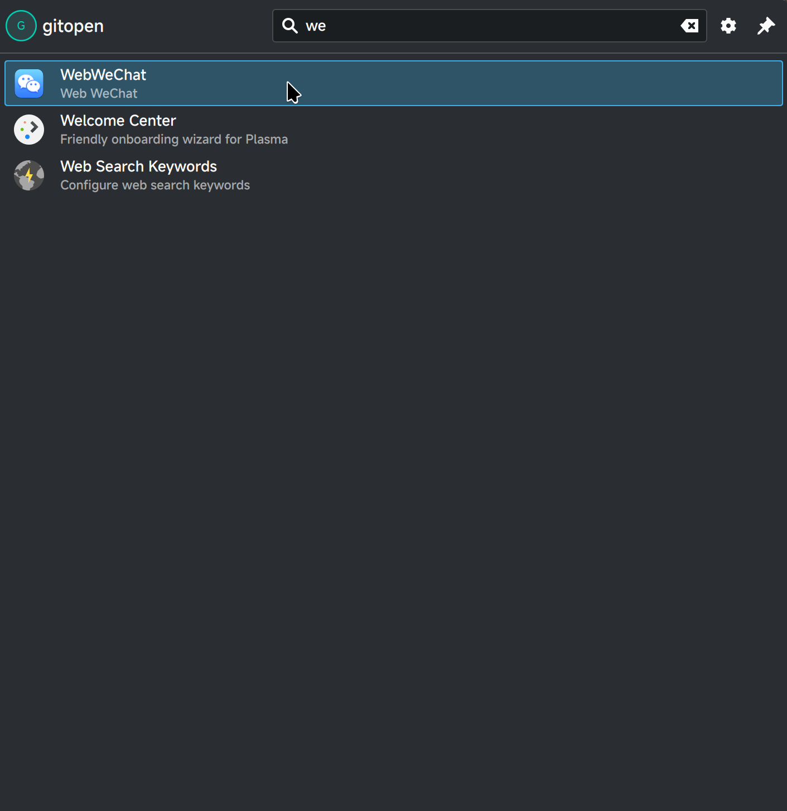
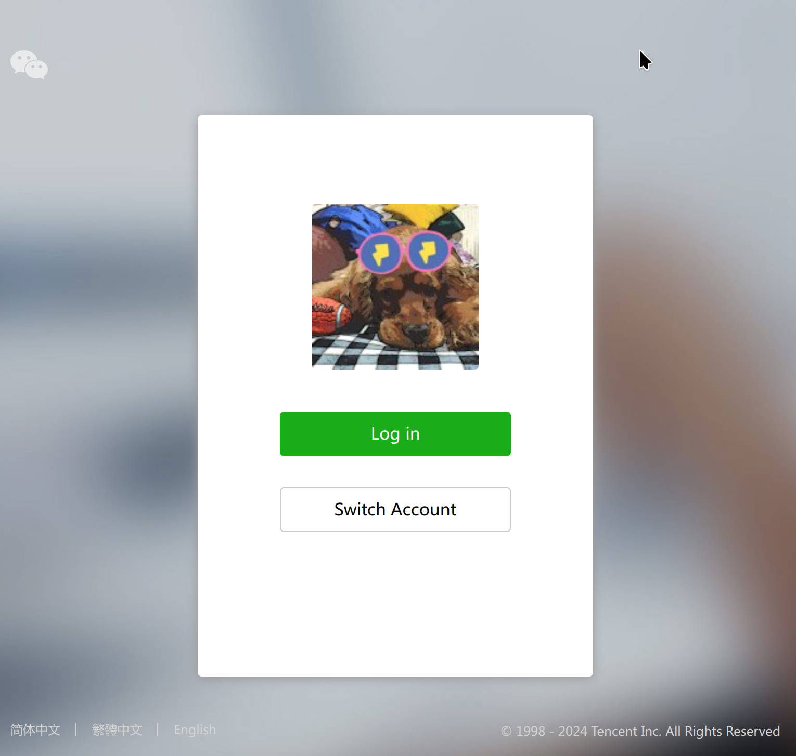
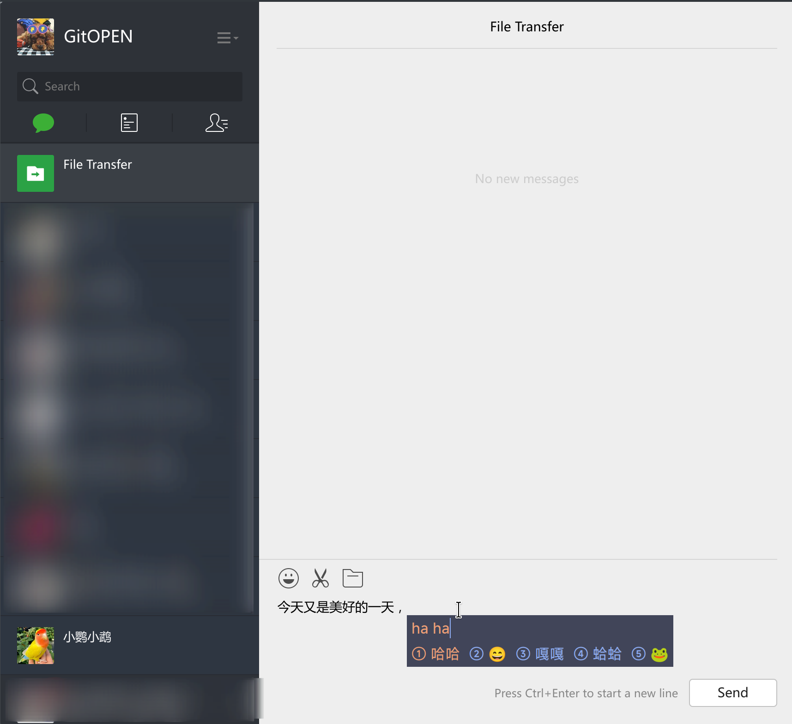
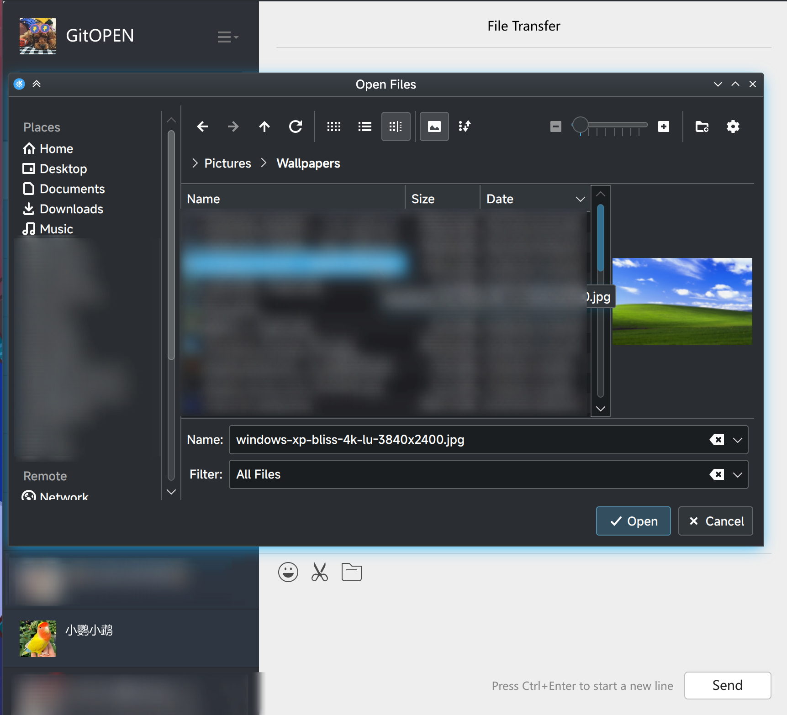

# WebWeChat

使用Electron打包的网页微信。

# 简要说明

`out/make/`文件夹下的`zip/`中包含了**macOS**的安装包；`deb/`中包含了**Ubuntu**的安装包；

# 安装

macos下载安装包安装就好；Debian based distributions 使用下面的命令：

```shell
sudo dpkg -i web-wechat_1.0.1_amd64.deb
```

# 截图预览







# 动动小手指，点个star吧！~

# 愿好人好梦。
